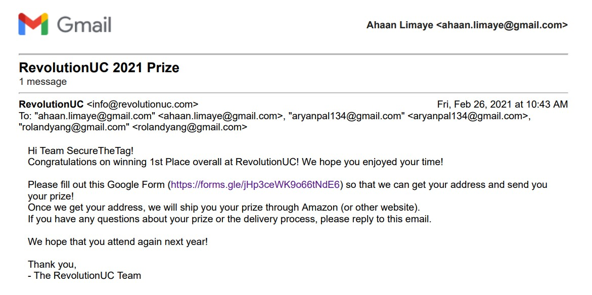
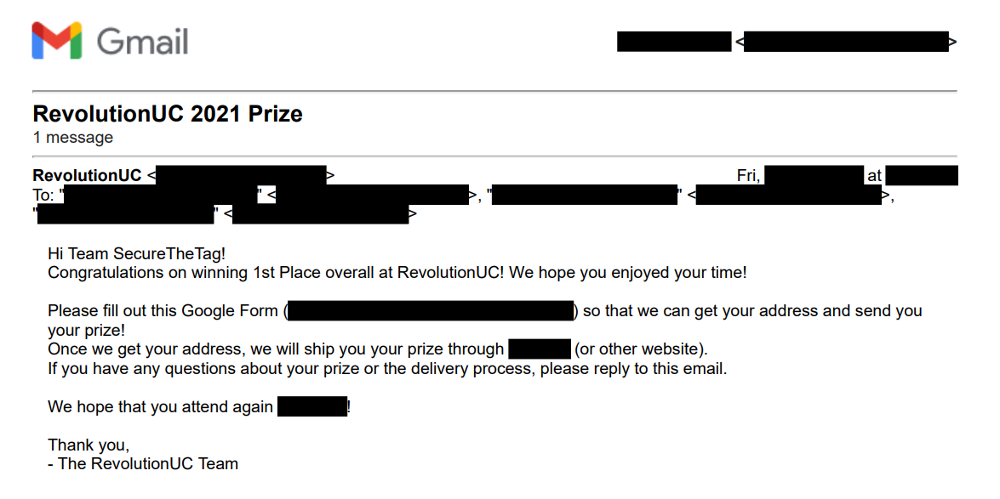
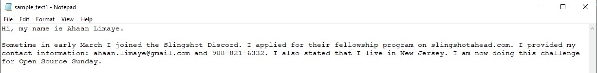
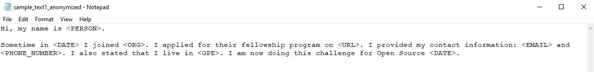

# Anonymity
A Python Script that uses Natural Language Processing to Anonymize Personally Identifiable Information (PII) in PDF and TXT documents while retaining information deemed important through keyword extraction

## Installation
Git Clone this Repository and CD into Repository:
```
git clone https://github.com/ahaanlimaye/anonymity
```
```
cd anonymity
```
Install Dependencies
```
pip install -r requirements.txt
```
```
python -m spacy download en_core_web_sm
```

## Usage
Run `anonymize.py` in command line with the following arguments:
- Path to File (This can easily be done by dragging and dropping your file in the command line window; File **DOES NOT** have to be in your Anonymity Workspace => it can be located anywhere on your computer)
- PII to anonymize (Called with "-i" option; Must use at least one ; Refer to PII table below)

This Script creates a new anonymized file with the ending "_anonymized" in the same directory as the inputted file
```
python anonymize.py <PATH TO PDF/TXT FILE> -i <PII #1> -i <PII #2> -i <PII #3> ...
```
Example
```
python anonymize.py c:\Users\ahaan\OneDrive\Desktop\workspace\pdf_txt_files\sample.pdf -i PERSON -i URL -i EMAIL -i PHONE_NUMBER -i DATE
```

### PII (Personally Identifiable Information) Options
Type | Description | Example 
--- | --- | --- 
PERSON | People, including fictional | Fred Flintstone
EMAIL | Any type of Email | johnsmith<span></span>@gmail.com
PHONE_NUMBER | Any Phone Number | 123-456-7890, (123) 456 7890
URL | Website or Download Links | wikipedia.com
PROPER_NOUN | Specific Person, Place, or Thing (Can sometimes be overriden by another PII, such as Person) | Walt Disney
NORP | Nationalities, Religions, or Political Groups | The Republican Party
FAC | Buildings, Airports, Highways, Bridges, etc. | Logan International Airport, The Golden Gate
ORG | Companies, Agencies, Institutions, etc. | Microsoft, FBI, MIT
GPE | Countries, Cities, States | France, UAR, Chicago, Idaho
LOC | Non-GPE Locations, Mountain Ranges, Bodies of Water | Europe, Nile River, Midwest
PRODUCT | Objects, Vehicles, Foods, etc. (Not Services) | Formula 1
EVENT | Named Hurricanes, Battles, Wars, Sports Events, etc. | Olympic Games
WORK_OF_ART | Titles of books, songs, etc. | The Mona Lisa
LAW | Named Documents Made into Laws | Roe v. Wade
LANGUAGE | Any Named Language | English
DATE | Absolute or Relative Dates or Periods | July 20 1969
TIME | Times Smaller than a Day | Four hours
PERCENT | Percentage, including "%" | Eighty percent
MONEY | Monetary Values, including unit | Twenty Cents
QUANTITY | Measurements, as of Weight or Distance | Several kilometers, 55kg
ORDINAL | "first", "second", etc. | 9th, Ninth
CARDINAL | Numerals that do not fall under another type | 2, Two, Fifty-two

## Examples
### PDF File
```
>>> python anonymize.py c:\Users\ahaan\OneDrive\Desktop\workspace\anonymity\samples\sample_email1.pdf -i PERSON -i EMAIL -i URL -i ORG -i DATE -i TIME    
Successfully Anonymized sample_email1.pdf in new file: sample_email1_anonymized.pdf
```
Before:

After:


### TXT File
```
>>> python anonymize.py c:\Users\ahaan\OneDrive\Desktop\workspace\anonymity\samples\sample_text1.txt -i PERSON -i ORG -i DATE -i TIME -i EMAIL -i PHONE_NUMBER -i URL -i GPE
Successfully Anonymized sample_text1.txt in new file: sample_text1_anonymized.txt
```
Before:

After:


## What it Uses
- Python
- SpaCy NLP Library
- PyMuPDF Library

## Known Bugs
- Some PDFs may not be redacted very clearly depending on the formatting of the PDF file
- Some PDFs may give errors due to being an outdated/unsupported PDF version
- Sometimes Phone Numbers may not be recognized due to unrecognized formats
- Not all PIIs may get recognized by the script

## Future Improvements/Goals
- Improve upon the NLP to be more accurate when it comes to identifying PIIs such as phone numbers, places, etc.
- Create a Front End for the application and host it online

## Questions?
Email me at ahaan.limaye@gmail.com
